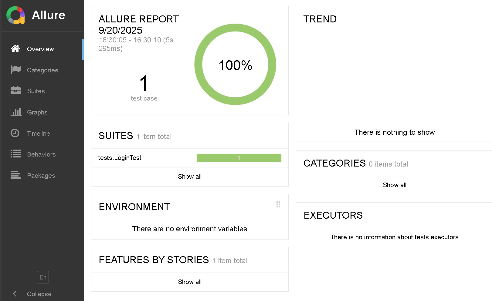
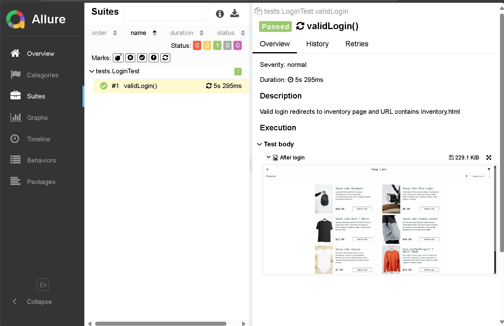

# 🛒 E-Commerce Testing Portfolio Project

[](https://github.com/ozturkeren/QA-TPs_ecommerce-testing-portfolio/.github/workflows/ci.yml)
[](LICENSE)

This project is part of my **QA Test Engineering portfolio**.  
It demonstrates skills in **manual testing**, **UI automation with Selenium**, **assertion design with AssertJ**, **reporting with Allure**, and **CI/CD integration via GitHub Actions**.

---

## 📌 Project Overview
- Application under test: [SauceDemo](https://www.saucedemo.com/)  
- Scope:
  - Manual test cases for login and checkout
  - Selenium WebDriver automation (Java + Gradle + JUnit 5)
  - Page Object Model (POM) design
  - Fluent assertions with AssertJ
  - Allure reporting with screenshots
  - CI pipeline using GitHub Actions (headless browser execution)

---

## 🛠 Tech Stack
- **Language**: Java 21  
- **Build Tool**: Gradle  
- **Frameworks**: Selenium WebDriver, JUnit 5, AssertJ  
- **Reporting**: Allure  
- **CI/CD**: GitHub Actions  
- **IDE**: IntelliJ IDEA (Community Edition)

---

## ▶️ Running Tests Locally

### Prerequisites
- Java 21 installed and `JAVA_HOME` configured  
- Chrome installed (latest stable)  
- Allure CLI (optional, for local reports)

### Run tests
```bash
# Windows
.\gradlew.bat test

# Linux / macOS
./gradlew test
```
---

## 📊 Viewing Reports

### 📷 Sample Screenshots

Visual evidence from test execution and reporting tools.    

**Examples:**  
- ✅ Allure Dashboard with summary metrics  
- ✅ Test details with attached screenshots  

  
*Allure dashboard showing test pass rate and execution timeline.*  

  
*Detailed test case execution with step-by-step logs and attached screenshot.*  

### 🔹 Allure Report
To generate and open an interactive HTML report with screenshots:
```bash
allure serve <build/allure-results> # Write the directory path
```
This opens a browser window showing:
- Step-by-step test execution  
- Screenshots captured during the test  
- Descriptions and assertions  

---

### 🔹 Standard Gradle Reports
After running tests, you can also open the plain Gradle test report:  
```
build/reports/tests/test/index.html
```
Provides a summary of test cases, pass/fail counts, and execution times.

---

## ⚙️ Continuous Integration

This project runs tests automatically on **every push** via GitHub Actions.  
- Browser runs in **headless mode** in CI  
- Allure results and JUnit reports are uploaded as **artifacts**  
- Status badge above reflects the latest build outcome  

---

## 📝 Manual Test Cases

Located in [`test-cases/`](test-cases/).  
Includes:  
- Login (positive & negative)  
- Product search  
- Add to cart  
- Checkout  

---

## 📄 License

This project is licensed under the [MIT License](LICENSE).  

---

## 🙋 About Me

I am an aspiring **QA/Test Engineer** passionate about building quality into software through a mix of manual, exploratory, and automated testing.  
I am open to **internship and junior QA opportunities** across the EU.  
  
📫 Connect with me on [LinkedIn](https://www.linkedin.com/in/ozturk-eren/) by sending messages.
